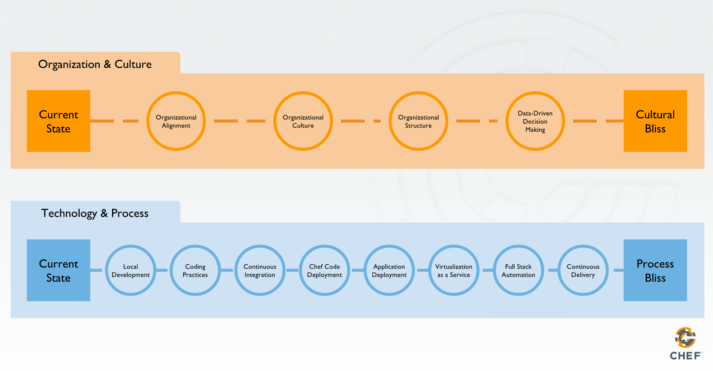

<!-- .slide: data-background="images/shaolin-masters.jpg" -->
# Chef DOJO
## DevOps Journey Assessment

Note:
This is a speaker note for the first slide

# Agenda
1. The DevOps Journey
1. DOJO Mechanics
1. Working with People
1. Working with Machines

# The DevOps Journey
1. DevOps Journey Map
1. The Journey Phases
1. What You Get When We Are Done

# DevOps Journey Map
<!-- Insert revised Journey Map picture -->

# The Journey Phases

Multiple phases can and should be worked on in parallel 

The earlier phases evolve significantly as the journey progresses

It's natural to skip or inconsistently implement certain phases, so be aware of problems this causes in the later phases

Note:
As you make progress in advanced areas, such as full-stack-automation, the scope of early phases, such as testing, expands
In order to show value quickly, you will sacrifice compeleteness. This is techical debt. Be aware that as you try to improve your system, you will need to go back and clean up. Revisiting is good!

# What You Get When We Are Done
<!-- Show a completed DOJO sample spider graph -->

# DOJO Mechanics

1. Safety
1. Scoping
1. Goal Setting
1. Our Scale
1. Scoring

# Safety

This is a safe space. All of you should feel free to share openly and honestly without repercussions.

Note:
Make sure to get explicit support for this from the most senior person in the DOJO.

# Scoping

We focus on a service and the people who provide it.

1. Development
1. Operations
1. Management
1. Architecture
1. Testing
1. Security
1. Compliance
1. Release
1. Support

# Goal Setting

In this exercise, we want to assess your current state. After you have that, we want you to agree to a six month goal.

# Our Scale

#### 
0   Not planned

---
#### 
1   Planned

---
#### 
2   Inconsistently implemented in some areas

---
#### 
3   Consistently implemented in some areas

---
#### 
4   Consistently implemented throughout the organization

# Scoring

The sections of the DOJO each have a few statements. For each section, we will follow this process:

1. Individuals score each statement for current state
1. Group shares scores
1. Group discusses any differing scores
1. Consenus on scores
1. Repeat for the goal

## Working with People

1. Organizational Success Factors
1. Organizational Culture
1. Data-Driven Decision Making
1. Coding Practices

## Organizational Success Factors

1. The organization widely recognizes IT as a competitive advantage to its business
1. The organization's leadership team recognizes IT as a competitive advantage
1. Clearly defined business champions lead change
1. Clearly defined technical champions lead change
1. A project with measurable business value been selected to be automatically deployed to production
1. There is a clear understanding of why the business is undertaking a technology transformation
            

## Organizational Culture (Westrum)

1. Information is actively sought
1. Responsibilities and risks are shared
1. Cross-functional collaboration is encouraged and rewarded
1. New ideas and innovations are welcomed
1. Failure leads to inquiry

## Data-Driven Decision Making

1. The organization has quantifiable goals
1. The organization's goals are visible to all of its members
1. Data is collected and used to make decisions
1. Cost and utilization are monitored
1. Monitoring data from pre-production environments is used to make release decisions
1. Monitoring provides business performance information

## Coding Practices

1. Developers follow code inspection standards (rubocop, foodcritic, etc.)
1. Code reviews are performed and results are shared with developers
1. Every change is reviewed by at least two people with relevant skill and contextual knowledge
1. Software and automation components are shared and co-developed
1. Any potential contributor to a project can find its code and documentation with minimal assistance
1. Regularly scheduled automation demos occur
1. The codebase is almost always in a releasable state

## Working with Machines

1. Version Control
1. Chef Local Development
1. Continuous Integration
1. Chef Code Deployment
1. Application Deployment
1. Continuous Delivery
1. Virtualization as a Service
1. Full-Stack Automation
1. Compliance Automation
1. Sustaining Operations Culture

## Version Control

1. All source code is stored in a version control system (VCS)
1. All infrastructure and deployment code is stored in VCS
1. Developers can view projects in VCS
1. Developers suggest and/or provide changes to projects in VCS
1. Developers create new projects in VCS as needed
1. VCS shows who is responsible for each codebase
1. Code documentation is easy to write and is viewable by all with VCS access

## Chef Local Development

1. Developers provision their own isolated VMs as needed
1. Developers use VM images that closely resemble production systems
1. Developers use Chef development tools (ChefDK, Vagrant, etc)
1. Chef development workstation setup is automated
1. Developers download code dependencies in a friction-free manner
1. Developers run unit tests (ChefSpec) locally
1. Developers run functional tests (ServerSpec) locally
1. Developers run complaince checks (InSpec) locally
1. Developers use Test Kitchen to verify that cookbooks work as intended

## Continuous Integration

1. All projects use a CI service
1. The CI service automatically tests new branches
1. CI job templates exist for each type of software project (Chef cookbook, Java app servers, Node.js app, etc.)
1. CI jobs lint projects
1. CI jobs unit test projects
1. CI jobs integration test projects
1. CI jobs execute functional tests against projects
1. CI jobs verify complaince of projects
1. CI makes the quality of the code base highly visible
1. CI confirms that versions are unique
1. CI jobs automatically update dependencies
1. CI jobs use monitoring to assess each change's effect on system health

## Chef Code Deployment

1. CI jobs upload cookbooks to a Chef server
1. Cookbook updates are only uploaded via CI
1. All non-cookbook Chef policy (environments, roles, data bags, etc.) is only uploaded via CI
1. CI jobs pin dependencies so that they cannot be modified in later deployments
1. CI jobs assign a set of cookbook versions to a Chef environment
1. Cookbook deployments are automated
1. Cookbook deployment automation manages the sequence of deployments

## Application Deployment

1. Applications are deployed without manual intervention
1. Applications follow a clear promotion path (e.g., Dev -> QA -> Staging -> Production)
1. Application deployment automation manages the sequence of deployments (e.g.: Database schema first, then app servers)
1. CI jobs automatically update, pin, and test runtime dependencies of applications
1. Application deployment automation performs parallel, rolling, and/or canary deployments
1. Deployments are run during the business day without causing negative user experiences

## Continuous Delivery

1. All validation and deployments are executed in a pipeline that goes from source control all the way to production
1. Small batches of work flow through the pipeline
1. Changes are released weekly, if not more frequently
1. Changes that pass validation are automatically released to production

## Virtualizaton as a Service

1. All servers are provisioned via APIs
1. The API is a generally accepted API such as EC2, Azure, OpenStack, vSphere, Docker
1. Access restrictions allow authorized users (e.g., developers and operations) to provision resources, and deny unauthorized users
1. Resources are provisioned in a friction-free manner
1. System images are built via an automated process
1. System images are built from scratch or from a well known, trusted origin
1. System images are built in a pipeline
1. System images are frequently updated

## Full-Stack Automation

1. Storage resources are provisioned by code
1. Networking resources are provisioned by code
1. Identity services are managed by code
1. DNS is configured by code
1. Messaging queues are provisioned by code
1. Security validation is performed by code
1. Performance validation is performed by code
1. The entire application is test provisioned and deployed in an alternate datacenter

## Compliance Automation

1. Compliance policies are expressed in code
1. Compliance is checked automatically
1. Compliance automation removes non-compliant nodes from production upon detection
1. Nodes are destroyed beyond a certain age (e.g. 30 days)

## Sustaining Operations Culture

1. Automated services stress the production system (e.g. Chaos Monkey)
1. Prodution alerts first notify those who wrote the code
1. Operations, Security, Network, Automation, Testing, and Compliance experts provide developer-friendly tools and coaching to enable development teams

